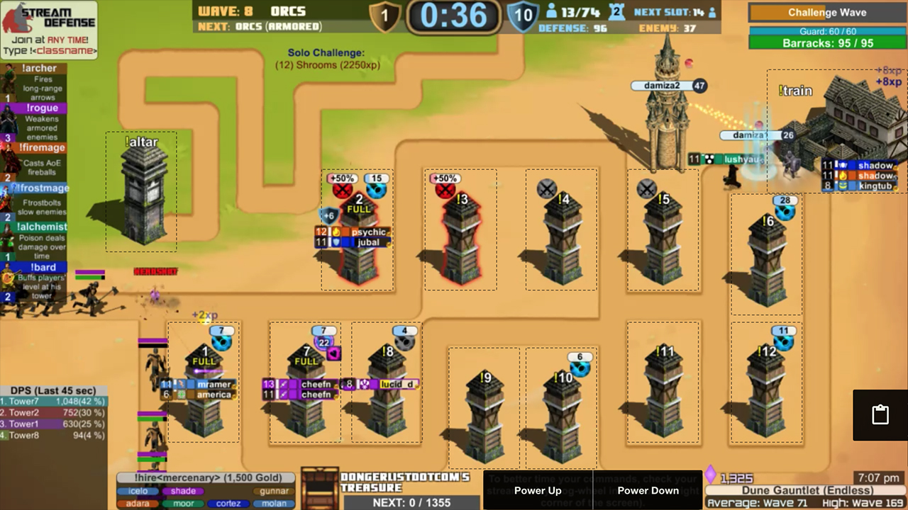

## Stream Defense Controller

Description to come later.

----

#### Todo:

* Save out image for Chrome store
* Write description for the Chrome store
* Dropdown that allows you to change gem
* Dropdown that allows you to get info about your char
* Research the missing elements on load
* Create Github explanation of the app
* Add version label to the popup
* Settings tab that allows you to disable the Twitch overlay
* Ability to use the plugin in all 3 states of the stream (normal, dark mode, and full screen mode)
* Look into removing some of the hot reload permissions
* Add map select screen to the list of overlays
* Add a way to buy1-5 on the map select screen

----

