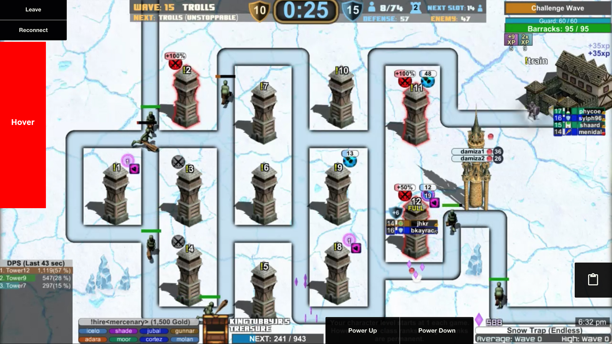
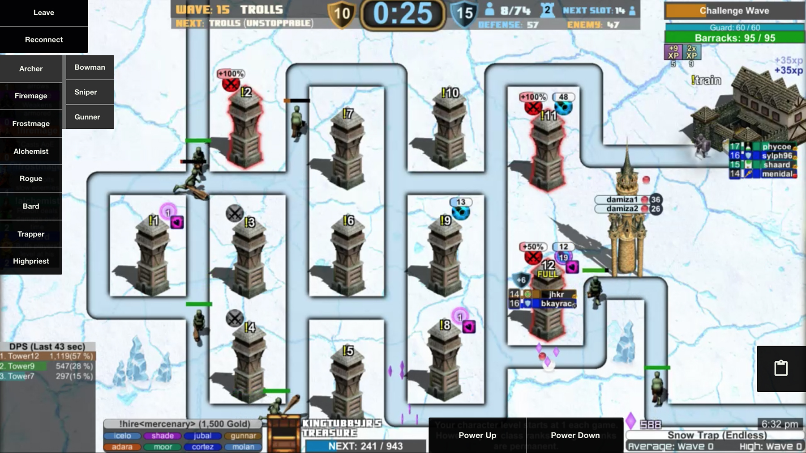
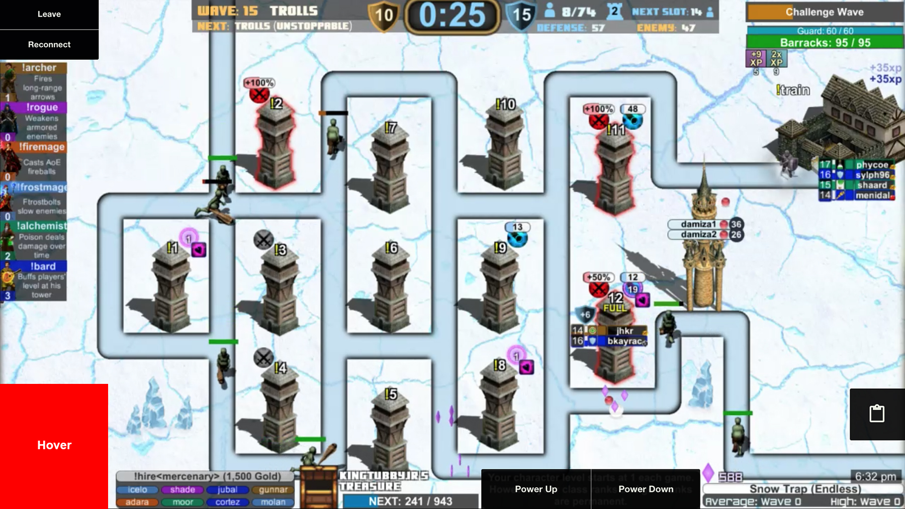
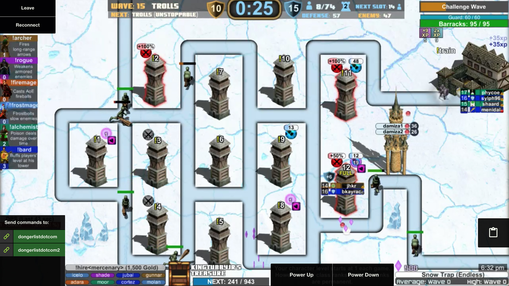
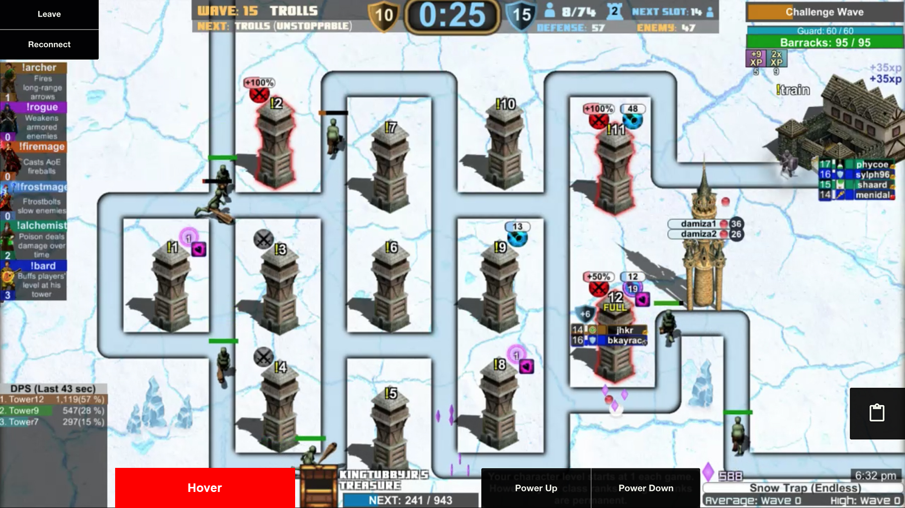
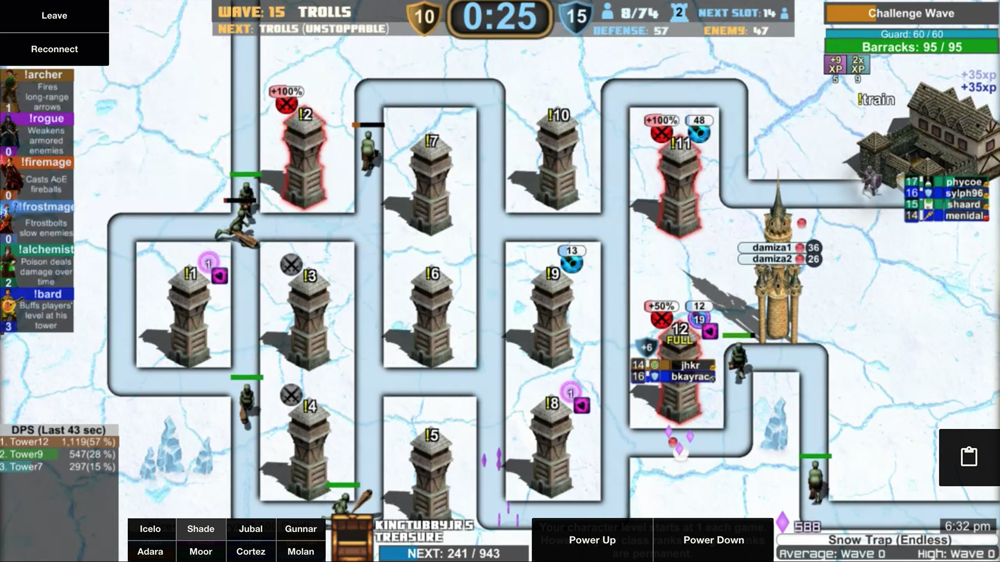

## Stream Defense Controller

Description to come later.

----

* [Getting started]()
* [UI Details]()
* [Updating the extension]()

----

### Getting started:

Write the basics here.

----

### UI Details

|||
|---|---|

1. [Classes and specs](#1-classes-and-specs)
2. [Accounts](#2-accounts)
3. [Hire merc](#3-hire-merc)
4. [Change map overlay](#4-change-map-overlay)
5. [Custom actions](#5-custom-actions)

----

#### 1. Classes and specs

|||
|---|---|

Hovering over the left hand side of the screen will bring out the classes and specs drawer. Here you can click on a class to select it or on a spec to switch to that spec.

----

#### 2. Accounts

|||
|---|---|

Hovering over the bottom left corner will show two things:

* What accounts are currently connected
* What account you want your actions to be sent to

If all of your accounts are highlighted green, any command you send will be sent from each of those accounts. If you want to only send commands from a specific account, make sure that's the only one that's highlighted.

If you see a green connection icon beside your account that means it's connected and ready to send commands. If you see a red icon, the account is not connected. This could be due to a incorrect Oauth key, or a disconnection from being AFK. You can hit the Chrome tower icon and hit disconnect and try to reconnect.

----

#### 3. Hire merc

|||
|---|---|

Description goes here.

----

#### 4. Change map overlay

Description goes here.

----

#### 5. Custom actions

Description goes here.

----

### Updating the extension

Write how to update the description here.