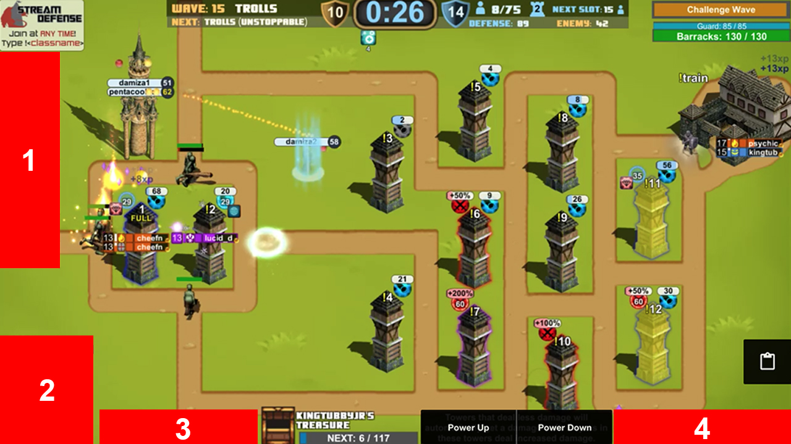

## Stream Defense Controller

Description to come later.

----

* [Todo]()
* [UI Details]()

----

### Todo:

* Save out image for Chrome store
* Write description for the Chrome store
* Dropdown that allows you to change gem
* Dropdown that allows you to get info about your char
* Research the missing elements on load
* Create Github explanation of the app
* Add version label to the popup
* Settings tab that allows you to disable the Twitch overlay
* Ability to use the plugin in all 3 states of the stream (normal, dark mode, and full screen mode)
* Look into removing some of the hot reload permissions
* Add map select screen to the list of overlays
* Add a way to buy1-5 on the map select screen
* Write guide on how to update extension
* Research versioning on chrome app
* Add a way to leave the game
* Add a way to reconnect to the game
* Test extension on a different computer

----

### UI Details

* **1** - [Classes and specs]()
* **2** - [Accounts]()
* **3** - [Hire merc]()
* **4** - [Change map overlay]()
* **5** - [Custom actions]()
* **6** - [Switch gem]()
* **7** - [Settings]()

----

#### Classes and specs

Description goes here.

----

#### Accounts

Description goes here.

----

#### Hire merc

Description goes here.

----

#### Change map overlay

Description goes here.

----

#### Custom actions

Description goes here.

----

#### Switch gem

Description goes here.

----

#### Settings

Description goes here.