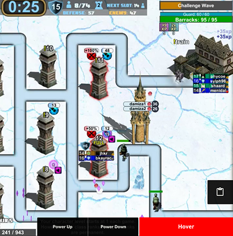

 

[Stream defense](https://www.twitch.tv/archonthewizard) is a game developed by [ArchonTheWizard](https://www.twitch.tv/archonthewizard) on [Twitch](https://www.twitch.tv/). It's a tower defense game that allows you to control your players using chat inputs. Instead of controlling your player using chat inputs, the Stream Defense Controller allows you to interact with the video instead.

----

### Table of Contents:

* [Installing the extension](#installing-the-extension)
* [Setting up your accounts](#setting-up-your-accounts)
* [Using the interface](#using-the-interface)
* [Version history](#version-history)

----

### Installing the extension:

* The extension can be found in the [Chrome Web Store](https://chrome.google.com/webstore/detail/stream-defense-controller/kdnmeicbpnbfjhoeofjpglbfcmhepdga?hl=en).
* Once installed you will see a tower icon (  ) appear at the top right hand corner of your browser.

----

### Setting up your accounts:

* Click on the tower icon in the top left hand corner and click `add account`.
* Head over to the `OAuth link` and generate yourself a OAuth token, copy the entire token (including the oauth: part)
* Now click on the tower icon and head over to the `add account` section again
* Fill out your username and paste the OAuth token and hit `Add User`
* Now with your user visible in the list, just click `Connect` (When you hit connect, make sure you're already on the stream defense twitch page)

At this point if you rollover the bottom left hand corner of the video you should see the accounts that you added. 

If the little link icon beside your name is green that means you are connected and ready to use the UI. If it's red that means something is wrong, either the username was mistyped or there is an issue with the OAuth token.

You are now ready to use the UI, read below for the specifics on each component.

----

### Using the interface

#### Legend:

1. [Change map overlay](#1-change-map-overlay)
2. [Custom commands](#2-custom-commands)
3. [Classes and specs](#3-classes-and-specs)
4. [Accounts](#4-accounts)
5. [Hire merc](#5-hire-merc)
6. [TTDBot commands](#6-ttdbot-commands)

----

#### 1. Change map overlay

|||
|---|---|

To enable clicking on the towers to move around you need to select the correct overlay first. Hover on the bottom right hand side of the video to reveal the map selection drawer.

Select the map you are currently on. If this is done correctly you will see a dashed outline around all of the buildings. You can you click on them to send commands to your account.

----

#### 2. Custom commands

|||
|---|---|

Rolling over the custom commands icon will reveal the custom commands panel. Here you can define your own custom commands that are not available in the user interface.

For example:

* !t !a
* !hpora
* !sp !sp !sp

----

#### 3. Classes and specs

|||
|---|---|

Hovering over the left hand side of the screen will bring out the classes and specs drawer. Here you can click on a class to select it or on a spec to switch to that spec.

----

#### 4. Accounts

|||
|---|---|

Hovering over the bottom left corner will show two things:

* What accounts are currently connected
* What account you want your commands to be sent to

If all of your accounts are highlighted green, any command you send will be sent from each of those accounts. If you want to only send commands from a specific account, make sure that's the only one that's highlighted green.

* If you see a green connection icon beside your account that means it's connected and ready to receive commands.  
* If you see a red icon, the account is not connected.

* This could be due to a incorrect Oauth key, or a disconnection from being AFK. To fix this you can try to disconnect and reconnect by clicking the tower icon (  ) and clicking disconnect, then reconnect.

----

#### 5. Hire merc

|||
|---|---|

Hovering over this area will bring up the mercenary drawer. Clicking on a merc will attempt to hire that merc if they are available.

----

#### 6. TTDBot commands

|||
|---|---|

Hovering over the timer area will down down a list of TTDBot commands.

Since some of the commands come through using whispers. The whisper will be sent to the chat window for you to see without having to check your whispers.

----

### Version History:

#### V 1.0.0:
* Main build

#### V 1.1.0:
* Added TTDBot commands list when hovering over the timer
* Fixed the bug where only text was clickable on the classes slide out
* Rearranged the classes slide out to match the order on the game screen
* Updated README to showcase the overlay feature and custom actions first to draw more attention to the more unique features.