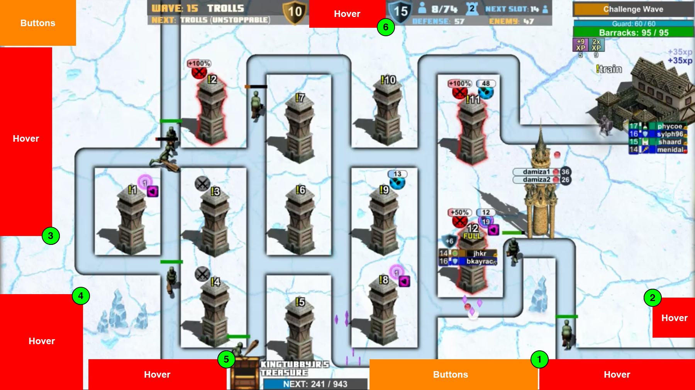

 

[Stream defense](https://www.twitch.tv/archonthewizard) is a game developed by [ArchonTheWizard](https://www.twitch.tv/archonthewizard) on [Twitch](https://www.twitch.tv/). It's a tower defense game that allows you to control your players using chat inputs. Instead of controlling your player using chat inputs, the Stream Defense Controller allows you to interact with the video instead.

----

### Table of Contents:

* [Installing the extension]()
* [Getting started]()
* [Using the interface]()

----

### Installing the extension:

* The extension can be found in the [Chrome Web Store](https://chrome.google.com/webstore/detail/stream-defense-controller/kdnmeicbpnbfjhoeofjpglbfcmhepdga?hl=en).
* Once installed you will see a tower icon (  ) appear at the top right hand corner of your browser.

----

### Setting up your account:

* Click on the tower icon in the top left hand corner and click `add account`.
* Head over to the `OAuth link` and generate yourself a OAuth token, copy the entire token (including the oauth: part)
* Now click on the tower icon and head over to the `add account` section again
* Fill out your username and paste the OAuth token and hit `Add User`
* Now with your user visible in the list, just click `Connect` (When you hit connect, make sure you're already on the stream defense twitch page)

At this point if you rollover the bottom left hand corner of the video you should see the accounts that you added. 

If the little link icon beside your name is green that means you are connected and ready to use the UI. If it's red that means something is wrong, either the username was mistyped or there is an issue with the OAuth token.

You are now ready to use the UI, read below for the specifics on each component.

----

### Using the interface

1. [Classes and specs](#1-classes-and-specs)
2. [Accounts](#2-accounts)
3. [Hire merc](#3-hire-merc)
4. [Change map overlay](#4-change-map-overlay)
5. [Custom actions](#5-custom-actions)

----

#### 1. Classes and specs

|||
|---|---|

Hovering over the left hand side of the screen will bring out the classes and specs drawer. Here you can click on a class to select it or on a spec to switch to that spec.

----

#### 2. Accounts

|||
|---|---|

Hovering over the bottom left corner will show two things:

* What accounts are currently connected
* What account you want your actions to be sent to

If all of your accounts are highlighted green, any command you send will be sent from each of those accounts. If you want to only send commands from a specific account, make sure that's the only one that's highlighted.

If you see a green connection icon beside your account that means it's connected and ready to send commands. If you see a red icon, the account is not connected. This could be due to a incorrect Oauth key, or a disconnection from being AFK. You can hit the Chrome tower icon and hit disconnect and try to reconnect.

----

#### 3. Hire merc

|||
|---|---|

Description goes here.

----

#### 4. Change map overlay

Description goes here.

----

#### 5. Custom actions

Description goes here.