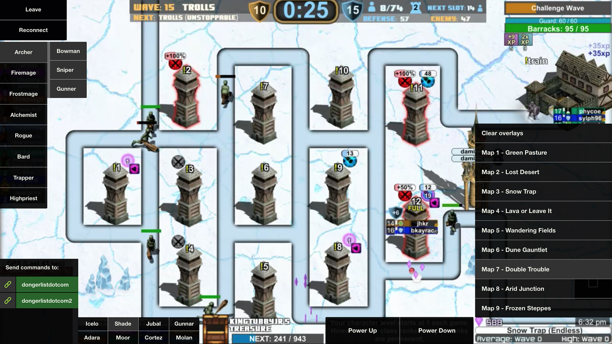

## Stream Defense Controller

Description to come later.

----

* [Getting started]()
* [UI Details]()
* [Updating the extension]()

----

### Getting started:

Write the basics here.

----

### UI Details

||||
|---|---|---|

1. [Classes and specs]()
2. [Accounts]()
3. [Hire merc]()
4. [Change map overlay]()
5. [Custom actions]()
6. [Switch gem]()
7. [Settings]()

----

#### 1. Classes and specs

|||
|---|---|

Description goes here.

----

#### 2. Accounts

Description goes here.

----

#### 3. Hire merc

Description goes here.

----

#### 4. Change map overlay

Description goes here.

----

#### 5. Custom actions

Description goes here.

----

#### 6. Switch gem

Description goes here.

----

#### 7. Settings

Description goes here.